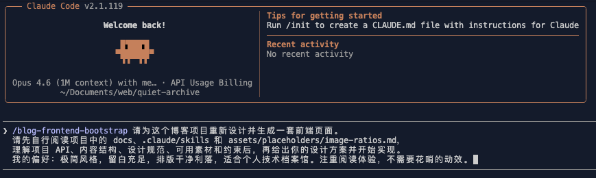

<div align="center">

# Quiet Archive · 静档

**文件系统驱动的个人档案馆基座**
构建一个安静、长期、可编程的个人知识档案。
既是可阅读的网站，也是可被 Agent 使用的知识库。

*A quiet, file-driven personal archive — readable as a website, queryable as a knowledge base, reusable by agents.*

[简体中文](#简体中文) · [English](#english)

<table align="center">
  <tr>
    <td align="center"><b>Theme 1: Quiet</b></td>
    <td align="center"><b>Theme 2: Vibrant Forest</b></td>
  </tr>
  <tr>
    <td></td>
    <td></td>
  </tr>
</table>

<p align="center">
  
</p>

</div>

---

## 简体中文

### 这是什么

这是一套**个人档案馆基座**，不是又一个博客主题：

- **内容** 放在你自己的私有 Git 仓库里，用 Markdown 写
- **结构** 由文件系统直接决定（文件夹即类型栏，`README.md` 即目录页）
- **网站** 由你自己的服务器拉取构建，Nginx 托管
- **API 层** 是一等公民 —— 同一份内容既喂页面，也能喂 Agent / MCP / Skill
- **前端** 建议你用 Claude Code + 内置的 `blog-frontend-bootstrap` skill **生成属于自己的一套设计**，而不是套用一个模板

### 与 GitHub Pages / VitePress 的取舍

GitHub Pages 和 VitePress 都是成熟方案，也可以通过 GitHub Actions、插件、自定义构建或额外服务扩展出很多能力。这里比较的不是"能不能做到"，而是各自的**默认定位**和 Quiet Archive 想要优先解决的问题。

| 维度 | GitHub Pages | VitePress | Quiet Archive |
|---|---|---|---|
| 核心定位 | 静态站点托管 | 文档站点框架 | **个人档案馆基座** |
| 内容组织 | 适合发布静态页面 | 适合结构化文档站 | **以本地 Markdown 档案为事实来源** |
| 数据接口 | 通常需要自行生成 | 通常需要自行扩展 | **默认生成 JSON API 与搜索索引** |
| Agent 使用 | 可以额外适配 | 可以额外适配 | **把 API、索引和前端生成作为一等能力** |
| 视觉方向 | 取决于所选生成器或主题 | 默认文档主题，可深度定制 | **推荐用 AI 生成专属前台体验** |

### 核心设计

1. **文件即事实来源**：任何页面必须可以只用 Markdown + 索引 JSON 构建出来。
2. **结构从文件系统推导**：不写配置，文件夹怎么放，导航和 URL 就是什么样。
3. **API 优先**：`src/api/*` 是内部 SDK，并同时以静态 JSON 形式对外暴露。
4. **视觉层自由**：默认页面只是参考实现，推荐用 skill 让 Claude Code 为你生成专属版本。
5. **运行时是可选项**：关掉所有动态能力，核心档案仍然能访问。

### 快速开始

```bash
# 需要 Node >= 22.12（附带 npm >= 10）& Python >= 3.10

git clone git@github.com:<you>/quiet-archive.git  # ← 替换 <you> 为你的 GitHub 用户名
cd quiet-archive
npm install
pip3 install -r scripts/requirements.txt

# 生成索引 + 启动开发服务器
npm run index
npm run dev
```

浏览器打开 `http://localhost:4321` 即可预览默认展示页面。

完整流程：fork → clone → 本地预览 → 用 `blog-frontend-bootstrap` 生成专属前端 → 写文章 → push → 服务器自动构建上线。详见 **[docs/getting-started.md](./docs/getting-started.md)**。

### 项目结构

```
quiet-archive/
├── posts/            你的 Markdown 内容（事实来源）
├── scripts/          Python 构建脚本
│   ├── build_index.py         内容索引
│   ├── build_search_index.py  搜索索引（含中文分词）
│   └── check.py               内容校验
├── src/
│   ├── api/          内容查询层（稳定核心，不要改）
│   ├── pages/        路由 + 静态 JSON API 端点
│   ├── components/   组件
│   ├── layouts/      布局
│   └── styles/       设计 tokens
├── public/           构建产物：索引 JSON + 搜索索引
├── dist/             构建产物：静态站点 + /api/*.json
├── assets/           图片等静态资源
├── docs/             项目文档
└── .claude/skills/   Claude Code 使用的 skills
```

### 文档

- [Getting Started](./docs/getting-started.md) — 部署与使用指南
- [Architecture Overview](./docs/architecture-overview.md) — 代码架构讲解
- [API Reference](./docs/api-reference.md) — API 与 MCP 接入
- [Content Authoring](./docs/content-authoring.md) — 内容创作规范
- [CHANGELOG](./CHANGELOG.md) — 版本更新日志

### 内置能力

- 📄 灵活的内容类型：`article` / `note` / `column` 等，可随时新增
- 🗂️ 任意深度嵌套的目录结构，每层 `README.md` 即目录页
- 🔍 全文搜索：构建时中文分词（jieba）+ 客户端字段权重匹配，无需外部搜索服务
- 📡 零运行时的静态 JSON API：`/api/types.json`、`/api/entries.json`、`/api/entry/<uri>.json`、`/api/tree.json`、`/api/stats.json`、`/api/tags.json`、`/search-index.json`
- 🤖 Agent / MCP / Skill 开箱即用的知识库接入能力
- 🎨 内置 `blog-frontend-bootstrap` skill，让 AI 为你生成专属前端

### 作为 Agent 知识库

本项目的内容天然适合作为 Agent 的长期记忆：

- 每条内容都有稳定 URI
- 结构化的 frontmatter（tags, series, type）
- 静态 JSON API + 搜索索引可直接被 Agent / MCP / Skill 消费

你写一次，内容既喂读者，也喂你的 Agent，也可以通过 MCP 喂别人的 Agent。

### Roadmap

- [x] 文件系统驱动的内容模型
- [x] 内容索引 / 路由表 / 归档树生成
- [x] 内容校验脚本
- [x] 静态 JSON API 端点
- [x] 中文分词 + 全文搜索（构建时索引 + 客户端检索）
- [x] 内容查询 API 层（`src/api/*`）
- [x] 前端生成 Claude Code skill
- [x] 默认展示页面（参考实现）
- [ ] 增量构建支持（提升大量内容时的构建性能）
- [ ] **独立的 MCP server 包**（消费本仓 `/api/*.json`）
- [ ] 分享图生成（论文封面风格）
- [ ] 可选运行时：SQLite 浏览计数
- [ ] 可选运行时：AI 摘要 / embedding 缓存
- [ ] 发布工作流：一键 `publish` 脚本串联校验 / 索引 / 分享图 / push / 远端 hook
- [ ] 站点地图 (sitemap.xml) 与 RSS 自动生成
- [ ] 智能下架与重定向管理

### 技术栈

- [Astro](https://astro.build) — 静态站点生成
- [Preact](https://preactjs.com) — 交互组件（岛屿架构）
- [MDX](https://mdxjs.com) — 富文本内容
- TypeScript — 类型安全
- Python 3 + [jieba](https://github.com/fxsjy/jieba) — 构建脚本 + 中文分词

### 设计原则

- 安静、克制的视觉方向
- 文件系统驱动，不依赖数据库
- 一切纳入版本控制
- 结构化、可检索
- 为长期存续而构建

> Build quietly. Archive everything.

### License

MIT. See [LICENSE](./LICENSE).

---

## English

### What is this

A foundation for a **personal archive**, not another blog theme:

- **Content** lives in your own private Git repo, written in Markdown
- **Structure** is derived directly from the filesystem (folders are type columns, `README.md` is the directory page)
- **Site** is built on your own server, served by Nginx
- **API layer** is a first-class citizen — the same content serves pages, agents, MCP servers, and skills
- **Frontend** is expected to be generated by you with Claude Code + the bundled `blog-frontend-bootstrap` skill, not adopted from a template

### Core design principles

1. **Files are the source of truth** — any page can be built from just Markdown + generated JSON indexes
2. **Structure is derived from the filesystem** — no config, just folders
3. **API-first** — `src/api/*` is the internal SDK, also exposed as static JSON
4. **Visual layer is yours** — the default pages are reference implementations; use Claude Code + a skill to generate your own
5. **Runtime is optional** — turn off every dynamic feature and the core archive still works

### Quick start

```bash
# Requires Node >= 22.12 (with npm >= 10) & Python >= 3.10

git clone git@github.com:<you>/quiet-archive.git  # ← replace <you> with your GitHub username
cd quiet-archive
npm install
pip3 install -r scripts/requirements.txt

npm run index   # generate content indexes
npm run dev     # development server at http://localhost:4321
npm run build   # production build (content + search index + static API)
```

Full flow: fork → clone → preview default pages → generate your own frontend with `blog-frontend-bootstrap` → write → push → auto-deploy. See **[docs/getting-started.md](./docs/getting-started.md)**.

### Docs

- [Getting Started](./docs/getting-started.md)
- [Architecture Overview](./docs/architecture-overview.md)
- [API Reference](./docs/api-reference.md)
- [Content Authoring](./docs/content-authoring.md)
- [CHANGELOG](./CHANGELOG.md)

### Built-in Capabilities

- 📄 Flexible content types: `article` / `note` / `column` and more, easily extensible
- 🗂️ Arbitrary-depth nested directories; every `README.md` becomes a directory page
- 🔍 Full-text search: Chinese segmentation (jieba) at build time + client-side field-weighted matching
- 📡 Zero-runtime static JSON API endpoints
- 🤖 Ready for Agent / MCP / Skill integration as a knowledge base
- 🎨 Built-in `blog-frontend-bootstrap` skill for AI-generated custom frontends

### Roadmap

- [x] Filesystem-driven content model
- [x] Content / route / archive-tree index generation
- [x] Content validation script
- [x] Static JSON API endpoints
- [x] Chinese segmentation + full-text search
- [x] Content query API layer (`src/api/*`)
- [x] Claude Code skill for frontend generation
- [x] Default reference pages
- [ ] Incremental build support (performance for large archives)
- [ ] **Standalone MCP server package** (consuming `/api/*.json`)
- [ ] Share-image generation (academic-paper-cover style)
- [ ] Optional runtime: SQLite view counter
- [ ] Optional runtime: AI summary / embedding cache
- [ ] One-shot `publish` script (check / index / share / push / hook)
- [ ] sitemap.xml + RSS auto-generation
- [ ] Smart unpublish & redirect management

### Stack

- [Astro](https://astro.build), [Preact](https://preactjs.com), [MDX](https://mdxjs.com), TypeScript, Python 3 + [jieba](https://github.com/fxsjy/jieba)

### Principles

- Quiet and restrained visuals
- Filesystem-driven, no database dependency
- Everything version-controlled
- Structured and searchable
- Built to last

> Build quietly. Archive everything.

### License

MIT. See [LICENSE](./LICENSE).
