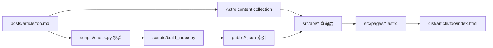
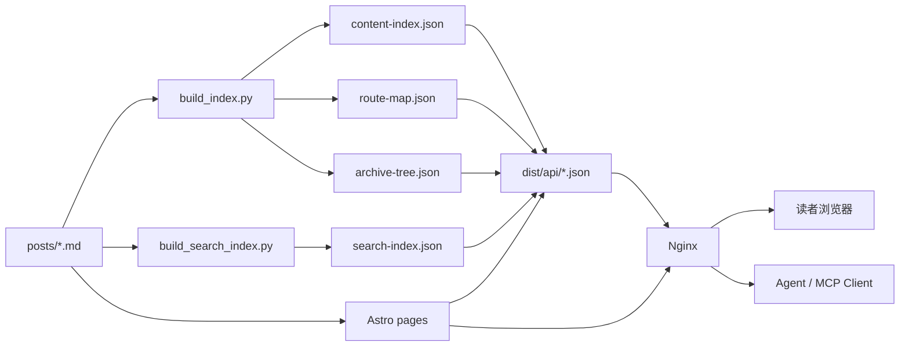

# Architecture Overview

这是项目的代码地图。读完你应该知道：**内容放在哪里、数据怎么流、页面怎么长出来、什么是稳定层、什么是灵活层**。

---

## 1. 三层心智模型

```
┌─────────────────────────────────────────────────┐
│         灵活表层（每个 fork 用户自己写）          │
│   src/pages/*   src/components/*   src/styles/* │
└─────────────────────────────────────────────────┘
              ↑ 只调用，不修改
┌─────────────────────────────────────────────────┐
│            稳定核心（项目主体）                  │
│   src/api/*  src/content.config.ts              │
│   scripts/build_index.py  scripts/check.py      │
└─────────────────────────────────────────────────┘
              ↑ 读取
┌─────────────────────────────────────────────────┐
│         事实来源（你的内容）                      │
│   posts/**/*.md   posts/**/README.md            │
└─────────────────────────────────────────────────┘
```

三层各自的责任：

- **事实来源层**：Markdown 文件是内容的唯一事实。任何页面都能通过纯文件重建。
- **稳定核心层**：校验、解析、索引、查询 —— 只要这一层稳定，上面的视觉层怎么换都不会崩。
- **灵活表层**：页面、组件、样式。推荐由每个用户用 skill 重新生成，不需要保持与原项目一致。

---

## 2. 目录结构

```
quiet-archive/
├── posts/                  ← 事实来源：你的内容
│   ├── about.md
│   ├── <type>/
│   │   ├── README.md       类型栏元信息
│   │   ├── *.md            内容条目
│   │   └── <subdir>/       嵌套目录（最多 5 层）
│   │       ├── README.md
│   │       └── *.md
│
├── scripts/                ← 稳定核心：构建脚本
│   ├── build_index.py      生成 content-index / route-map / archive-tree
│   ├── check.py            frontmatter 校验 + URI 冲突检查
│   └── build_search_index.py  中文分词 + 生成 search-index.json
│
├── src/
│   ├── api/                ← 稳定核心：数据查询层
│   │   ├── types.ts        类型定义
│   │   ├── content.ts      内容发现 / 查询 / 分页
│   │   ├── navigation.ts   面包屑 / 上下篇
│   │   ├── stats.ts        统计聚合
│   │   └── assets.ts       资源引用解析
│   │
│   ├── content.config.ts   ← 稳定核心：Astro content collection 配置
│   │
│   ├── pages/              ← 灵活表层：路由
│   │   ├── index.astro
│   │   ├── archive.astro
│   │   ├── categories.astro
│   │   ├── about.astro
│   │   ├── stats.astro
│   │   ├── search.astro
│   │   ├── api/                ← 静态 API（构建时输出 JSON）
│   │   │   ├── types.json.ts
│   │   │   ├── entries.json.ts
│   │   │   ├── stats.json.ts
│   │   │   ├── tags.json.ts
│   │   │   ├── tree.json.ts
│   │   │   └── entry/[...uri].json.ts
│   │   └── [type]/
│   │       ├── index.astro      /article, /note, ...
│   │       └── [...slug].astro  /article/xxx, /article/yyy/zzz
│   │
│   ├── components/         ← 灵活表层：组件
│   ├── layouts/            ← 灵活表层：布局
│   └── styles/             ← 灵活表层：设计 token 与样式
│
├── public/
│   ├── content-index.json  构建产物：完整内容索引
│   ├── route-map.json      构建产物：URI → 文件 id
│   ├── archive-tree.json   构建产物：层级归档树
│   └── search-index.json   构建产物：分词后的搜索索引
│
├── assets/                 图片等资源
├── docs/                   文档
└── astro.config.mjs
```

---

## 3. 数据流

从一篇 Markdown 到一个 URL，完整路径：



关键约束（见 [technical-architecture.md](./technical-architecture.md)）：

> **普通页面渲染不能依赖数据库。核心档案必须可以仅由文件和生成索引渲染出来。**

这意味着：
- `src/api/*` 只读 Astro content collection 和静态 JSON
- 不存在"运行时查数据库才能拼出页面"的情况
- 任何有状态数据（浏览计数等）都是非核心的增强功能

---

## 4. 内容约定：文件系统即结构

这是项目最重要的设计决策。**没有 CMS，没有数据库，文件夹和文件名本身就是结构。**

### 4.1 类型栏 = `posts/` 的直属子文件夹

```
posts/article/        ← 类型栏 article
posts/note/           ← 类型栏 note
posts/project-log/    ← 类型栏 project-log
```

每个类型栏的 `README.md` 用 frontmatter 定义元信息：

```yaml
---
title: 文章
description: 正式技术文章与长文思考
display:
  defaultView: archive    # archive | timeline | cards | book | qa | project | gallery
  density: medium
order: 10
showInNav: true
---
```

### 4.2 子目录 = 专题 / 专栏 / 卷

```
posts/column/archive-story/
  README.md         ← 这个专栏的目录页元信息
  chapter-001.md
  chapter-002.md
```

任何深度的子目录都会被自动识别。子目录的 `README.md` 也走同一套 frontmatter 约定。

### 4.3 内容条目 = 非 README 的 `.md` / `.mdx`

文件名即 slug 的一部分。URI 规则：

| 文件路径 | URI |
|---|---|
| `posts/article/foo.md` | `/article/foo` |
| `posts/article/README.md` | `/article` |
| `posts/column/story/README.md` | `/column/story` |
| `posts/column/story/ch-01.md` | `/column/story/ch-01` |

相关实现：`scripts/build_index.py` 中的 `get_uri()`，`src/api/content.ts` 中的 `toContentEntry()`。

### 4.4 Frontmatter Schema

所有 `.md` / `.mdx` 支持的字段：

| 字段 | 类型 | 说明 |
|---|---|---|
| `title` | string | 标题（必填） |
| `date` | string | 日期 `YYYY-MM-DD` |
| `status` | `draft \| published \| archived` | 只有 `published` 会被发布 |
| `summary` | string | 摘要（列表展示用） |
| `description` | string | 描述（目录页用，回退到 summary） |
| `tags` | string[] | 标签 |
| `featured` | boolean | 是否精选 |
| `cover` | string | 封面图路径，推荐写成 `assets/...`，前端用 `resolveAssetSrc()` 解析 |
| `updated` | string | 更新日期 |
| `series` | string | 所属系列 |
| `order` | number | 自定义排序权重 |

README 专属字段：

| 字段 | 说明 |
|---|---|
| `display.defaultView` | 默认展示方式 |
| `display.density` | 展示密度 |
| `showInNav` | 是否出现在导航 |

### 4.5 图片资源与 `cover`

文章的 `cover` 字段保存的是内容作者声明的资源路径，推荐指向项目根目录 `assets/` 下的图片，例如：

```yaml
cover: assets/covers/my-post.png
```

前端不要直接把 `entry.cover` 当作最终图片地址使用，而应该通过 `src/api/assets.ts` 的 `resolveAssetSrc(entry.cover)` 解析。这样 Astro 才能在构建时正确处理本地图片资源、哈希文件名和最终输出路径。

---

## 5. 构建产物

`npm run build` 会生成两类产物：

### 5.1 索引 JSON（`public/`）

| 文件 | 用途 | 消费者 |
|---|---|---|
| `content-index.json` | 所有发布内容的扁平列表 | 列表页、归档 |
| `route-map.json` | URI → 文件 id 映射 | 调试、反查 |
| `archive-tree.json` | 按类型 / 层级组织的树 | 归档页、统计 |
| `search-index.json` | 分词后的搜索索引 | 搜索页、Agent 检索 |

### 5.2 静态 API JSON（`dist/api/`）

| 路径 | 内容 |
|---|---|
| `/api/types.json` | 所有类型栏 |
| `/api/entries.json` | 所有已发布条目 |
| `/api/entry/<uri>.json` | 单条详情（含正文） |
| `/api/tree.json` | 归档树 |
| `/api/stats.json` | 统计 |
| `/api/tags.json` | 标签频次 |

这些 JSON 是静态文件，Nginx 直接托管，`curl` / `fetch` / MCP client 都能直接消费。

### 5.3 静态站点（`dist/`）

Astro 构建输出。Nginx 直接托管这一份。

### 5.4 搭配关系图



---

## 6. API 层（`src/api/`）

这是**本项目相对其他博客框架最独特的一层**。把它当作"个人档案馆的内部 SDK"：

```ts
// 发现所有类型栏
discoverTypes(): Promise<TypeMeta[]>
getNavTypes(): Promise<TypeMeta[]>

// 查询内容
getAllEntries(): Promise<ContentEntry[]>
getEntriesByType(typeSlug: string): Promise<ContentEntry[]>
getEntriesInDir(dirPath: string): Promise<ContentEntry[]>
getSubDirectories(dirPath: string): Promise<ContentEntry[]>
getDirectoryListing(dirPath, { page, pageSize }): Promise<DirectoryListing>
getRecentEntries(limit?: number): Promise<ContentEntry[]>
getFeaturedEntries(): Promise<ContentEntry[]>
getEntriesByTag(tag: string): Promise<ContentEntry[]>
getEntryByUri(uri: string): Promise<ContentEntry | undefined>

// 导航
getBreadcrumb(uri: string): Promise<Breadcrumb[]>
getPrevNext(uri, typeSlug): Promise<{ prev?, next? }>
getTableOfContents(headings): TocItem[]

// 统计
getArchiveStats(): Promise<ArchiveStats>
```

这些函数既喂页面，也为未来的 HTTP API / MCP server 提供原生底座。详见 [api-reference.md](./api-reference.md)。

---

## 7. 页面实现原则

如果你要重写页面层，遵循这三条原则即可：

1. **只通过 `src/api/` 取数据**，不直接读 Astro collection、不解析 frontmatter。
2. **任何页面都应该在没有运行时的情况下能构建出来**（SSR 可选，但 fork 用户默认跑静态构建）。
3. **视觉完全由你决定**，不需要和默认实现一致。样式、设计 token、主题和组件边界都应服务于最终体验。

### 7.1 目录和子目录页面

目录页来自 `README.md`，在 `ContentEntry` 中会表现为 `entry.isDirectory === true`。前端生成时应把目录页当作专题/专栏/卷首页，而不是普通文章页。

推荐实现方式：

- **类型落地页**：对于某个内容类型根路径，先用 `getSubDirectories(typeSlug)` 展示直接子目录卡片，再用 `getEntriesInDir(typeSlug)` 展示当前类型根目录下的直接内容；如果没有子目录，再退回到普通列表。
- **子目录页**：对于任意深度的目录路径，使用目录页布局展示面包屑、标题、README 正文、子目录列表和直接子内容列表。
- **动态路由分流**：在 catch-all 路由中同时生成普通内容和目录内容，渲染时根据 `entry.isDirectory` 选择目录布局或正文布局。

简化示意：

```astro
{entry.isDirectory ? (
  <DirectoryLayout entry={entry} />
) : (
  <ContentLayout entry={entry} headings={headings}>
    {Content && <Content />}
  </ContentLayout>
)}
```

这样可以让 `posts/<type>/**/README.md` 形成层层可进入的目录页面，而不是被误渲染成普通文章。

推荐配合 `.claude/skills/blog-frontend-bootstrap` skill 让 Claude Code 基于项目 API、文档、内容结构和素材生成前台展示层，详见 [getting-started.md](./getting-started.md#3-用-claude-code-生成专属前端推荐流程)。

---

## 8. 扩展点

未来可能长出来的能力（都是**可选、不影响核心**）：

| 扩展 | 层次 | 状态 |
|---|---|---|
| 前端搜索 UI | 表层 | ✅ 已实现 |
| 搜索索引生成 | 核心 | ✅ 已实现 |
| 静态 JSON API | 核心 | ✅ 已实现 |
| MCP server 封装 | 外围 | 📋 规划中 |
| SQLite 浏览计数 | 外围 | 📋 后续 |
| AI 摘要生成 | 外围 | 📋 后续 |
| 分享图生成 | 核心 | 📋 后续 |

所有扩展都遵循同一条铁律：**关掉它们，核心档案仍然要能构建、能访问**。
